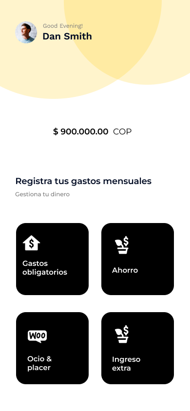
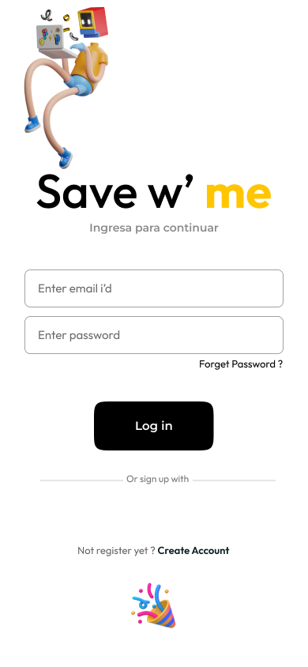

# Save w' me
Save w' me es una aplicación desarrollada con el fin de ser una herramienta que le permita al 
usuario gestionar sus ingresos y gastos durante el mes, permitiéndole tener un mejor control 
de sus finanzas personales y/o del hogar.

## Ingresos
En la aplicación podrá registrar su ingreso fijo mensual e ir agregando ingresos adicionales
en caso de tenerlos

## Gastos
El usuario podrá ingresar los gastos fijos y variables a medida que se presenten y la
aplicación hará el cálculo automático del saldo restante.

## Tecnologías
BBDD → SQLite

## Mockup

# Contribuyentes
Yonier Zapata → [@samirZapata](https://github.com/samirZapata)

Michael González → [@miklegonza](https://github.com/miklegonza)
